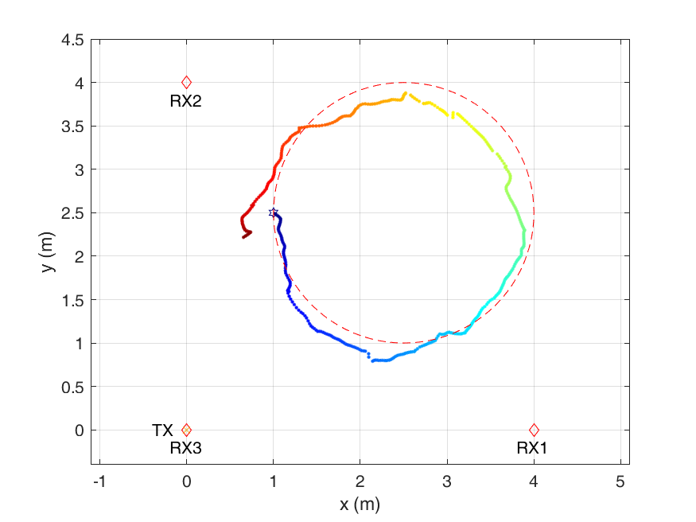
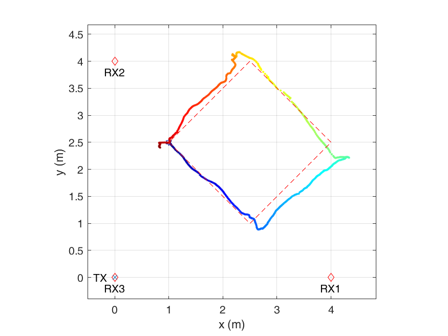

WiTraj: WiFi-based Motion Trajectory Reconstruction
====

Description
----
WiTraj is a WiFi-based motion trajectory reconstruction system. It tracks a person's motion contactlessly with a WiFi transmitter and three WiFi receivers. WiTraj uses the channel state information (CSI) extracted from WiFi receivers to estimate the Doppler Frequency Shift (DFS) caused by the person. It then uses the DFS and information of device positions to reconstruct the human motion trajectory. This project contains all the matlab code and sample data for WiTraj motion tracking system.

Setting
----
WiTraj requires four WiFi devices, i.e., one WiFi transmitter and three WiFi receivers. The placement of WiFi devices and field setting are shown below:

   

We set Tx to injection mode with a package injection rate of 400 per second, and Rx to monitor mode, so that three Rx can record CSI data simultaneously. WiTraj requires each Rx has no less than two antennas.

CSI Data Collection
----
We test WiTraj using Intel 5300 wireless NIC, and collect CSI with [Linux 802.11n CSI Tool](https://dhalperi.github.io/linux-80211n-csitool/). You may also try other wireless card and CSI collection tool, such as [Atheros CSI tool](https://github.com/xieyaxiongfly/Atheros-CSI-Tool).

For each walking, we have three CSI data collected from the three Rx. The CSI data is suffixed with -n to indicate which Rx it comes from.
e.g., if we want to collect a track with the name of `walking_circle`, then we should name the recorded CSI data as `walking_circle-1`, `walking_circle-2`, `walking_circle-3` for Rx1, Rx2, Rx3, respectively.

Code Structure
----
WiTraj	 repository
* code 		-- matlab code
  * main.m 	-- entrance for single data processing
  * batch.m 	-- entrance for batch processing

* data		-- sample CSI data (Intel 5300)
  * circle 	-- circle track
  * square 	-- square track
  * N 		-- zigzag track
  * Z 		-- zigzag track

Usage Example
----
In each data directory, there is a `config.mat` file. It contains the configuration information of WiFi device placement, the initial position of each track, and the reference groundtruth.

* main.m
The entrance for single data processing. Load main.m in matlab and run. The outputs are *reconstructed trajectory* picture and the *location sequence* matlab data file which are placed at `track` folder under each data directory.

* batch.m
The entrance for batch processing. Replace `dire` to calculate each trajectory shape in that directory. The output is the same as *main.m*.

Here are some examples of the reconstructed trajectory:

  
